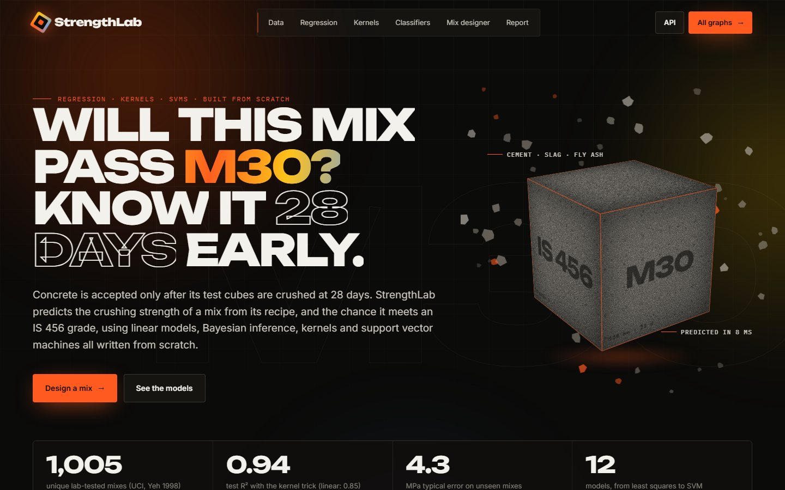
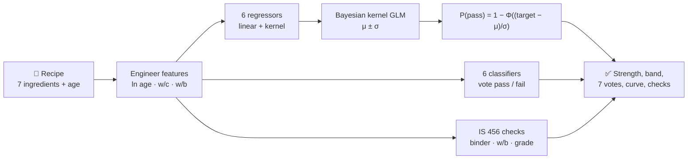
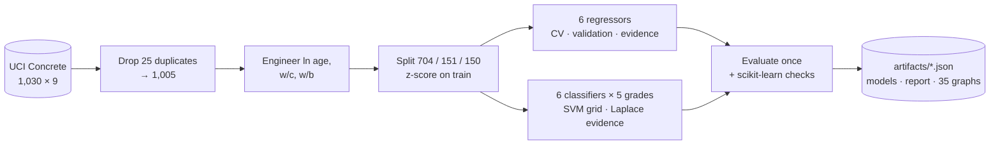
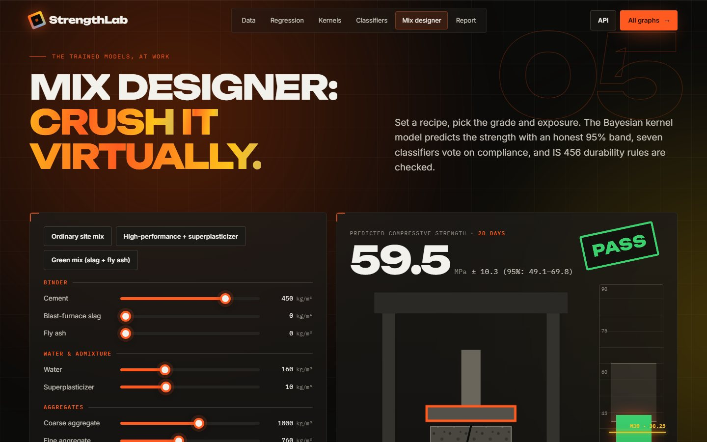
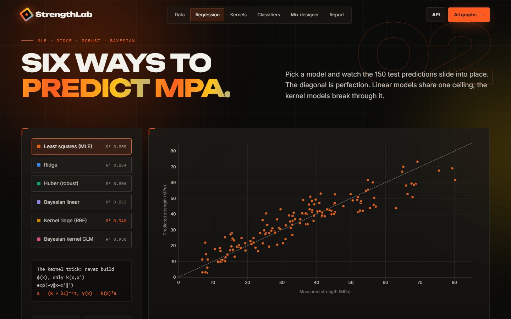
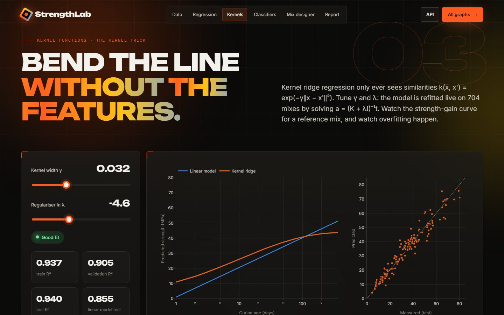
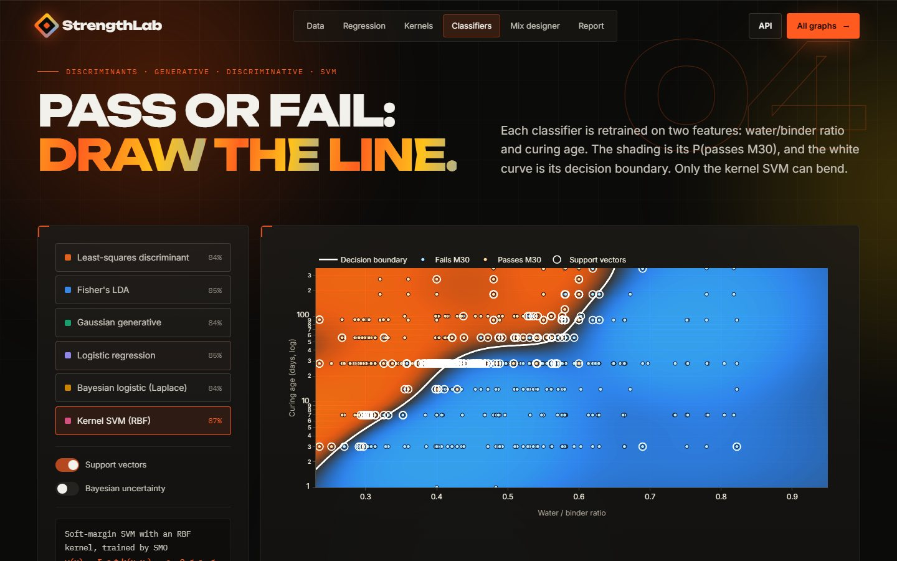
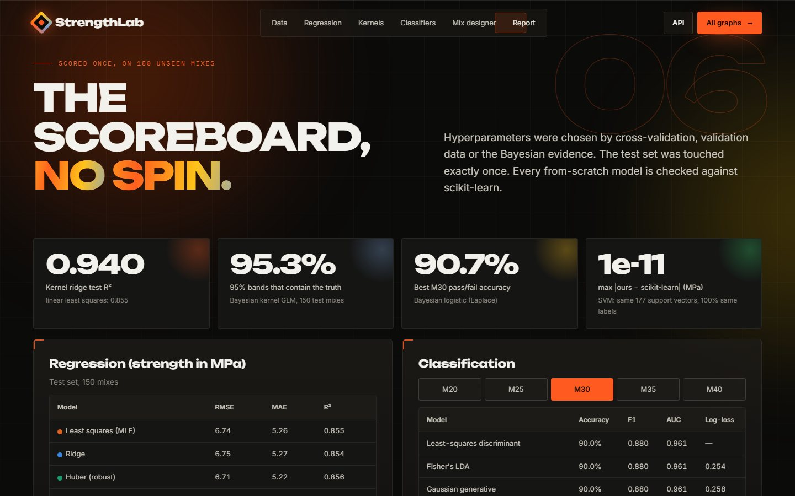
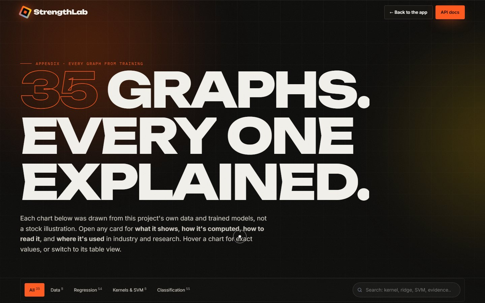
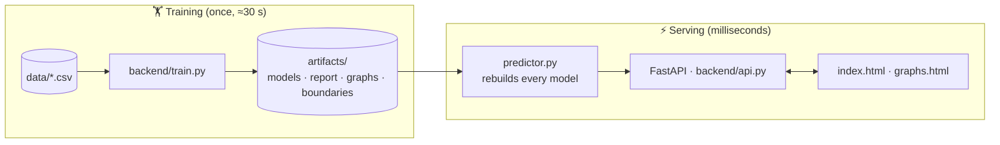

<div align="center">

# 🧱 StrengthLab

### Will this concrete pass M30? Know it *28 days* early.

**Type in a mix recipe → predicted strength with an honest error band, the chance it passes its IS grade, and the IS 456 checks.**<br>
Six regressors and six classifiers, each written from its equations in NumPy and trained on **1,030** real laboratory cube tests.




[The problem](#problem) · [What it does](#what) · [How it works](#how) · [Models](#models) · [Results](#results) · [Screenshots](#screenshots) · [Run it](#run)

</div>

---

## 📌 At a glance

| 🧪 Lab tests | 🧮 Models | 📏 Typical error | 🎯 Strength explained | ✅ Pass/fail accuracy (M30) | 📦 ML libraries in the models |
|:---:|:---:|:---:|:---:|:---:|:---:|
| **1,030** | **12** | **4.3 MPa** | **R² 0.940** | **90.7%** | **0** (pure NumPy) |

---

<a id="problem"></a>
## 🏗️ The problem

Concrete is the most widely used construction material in the world, and Indian practice specifies it by **grade**:
**M30** must reach a characteristic strength of 30 MPa at 28 days (IS 456:2000). The only way to confirm it:

```
  Day 0            Day 7              Day 28                  Day 28 + 1
  cast 150 mm  ──▶ crush a few    ──▶ crush the rest     ──▶  ❌ too weak?
  cubes            cubes (early)      (acceptance test)       the slab above is
                                                              already built…
```

Mix design (IS 10262:2019) aims for a **target mean strength f′ck = fck + 1.65 s**, so at most about 5% of cubes fall
short. Getting there takes trial batches, cement and time, and the effect of every ingredient is non-linear.
**StrengthLab predicts the crushing result from the recipe, in milliseconds, before anything is cast.**

---

<a id="what"></a>
## 💡 What it does

| | Question | Answer from StrengthLab |
|:---:|---|---|
| 📏 | **How strong will it be?** | Predicted MPa at any age, with a **95% band** from a Bayesian kernel model |
| ✅ | **Will it pass the grade?** | Probability of reaching the M20–M40 target, plus **seven models voting** pass or fail |
| 🛡️ | **Is it durable enough?** | The IS 456 Table 5 limits for the chosen exposure: minimum binder, maximum water/binder ratio, minimum grade |
| 📈 | **When will it get there?** | The strength-gain curve from day 1 to day 365, and the day it crosses the target |
| 🌱 | **How green is it?** | A rough embodied-CO₂ estimate, so you can try slag and fly ash in place of cement |

Plus a **regression lab** (six models side by side), a **kernel lab** (drag γ and λ and the server refits the model),
a **decision-boundary explorer** for every classifier, and a page that **explains all 35 training graphs**.

| Grade | M20 | M25 | M30 | M35 | M40 |
|---|:---:|:---:|:---:|:---:|:---:|
| **Target mean strength** (fck + 1.65 s) | 26.6 MPa | 31.6 MPa | **38.25 MPa** | 43.25 MPa | 48.25 MPa |

---

## 👥 Who it's for

<sub>*Illustrative personas, not real people.*</sub>

| 👷 The site engineer | 🏭 The ready-mix plant | 🎓 The civil-engineering student |
|---|---|---|
| The supplier changed the fly ash for tomorrow's slab pour. Before casting, they check the M30 margin and the w/b ratio against the "severe" exposure limits. | Cuts trial batches by only casting mixes the models expect to pass, and tests "green" mixes that replace cement with slag and fly ash. | Drags the water slider and sees Abrams' law happen: strength falls as the water/binder ratio rises, and slag and fly ash bloom later. |

---

<a id="how"></a>
## 🔄 How a prediction works



Every slider move sends one `POST /api/predict`, and the whole analysis comes back in milliseconds.

### Training pipeline



The whole pipeline runs in **about 30 seconds** on a laptop CPU.

---

<a id="models"></a>
## 🧠 The models

<details open>
<summary><b>Strength (regression)</b>: six ways to predict MPa</summary>

<br>

| Model | Idea | Tuned by |
|---|---|---|
| **Least squares** | Maximum likelihood under Gaussian noise; closed form, plus gradient descent for the loss curve | none |
| **Ridge** | A λ‖w‖² penalty tames correlated features | 5-fold CV over 36 values of λ |
| **Huber (robust)** | Quadratic for small errors, linear for big ones, fitted by IRLS, so one mistyped lab result can't drag the line | robust scale (MAD) |
| **Bayesian linear regression** | A prior on the weights gives a posterior and an **error bar for every prediction** | **evidence maximisation** (no validation set) |
| **Kernel ridge (RBF)** | The **kernel trick**: curved predictions from a 704 × 704 system | validation grid over γ × λ |
| **Bayesian kernel GLM** | RBF similarities to 300 prototype mixes, fed into Bayesian linear regression: curved *and* honest about uncertainty | validation log-density |

```math
\mathbf{a} = (K + \lambda I)^{-1}\mathbf{t}, \qquad y(\mathbf{x}) = \sum_{n} a_n\,k(\mathbf{x}, \mathbf{x}_n), \qquad k(\mathbf{x},\mathbf{x}') = e^{-\gamma\lVert \mathbf{x}-\mathbf{x}'\rVert^2}
```

</details>

<details>
<summary><b>Grade compliance (classification)</b>: seven judges vote</summary>

<br>

| Judge | Family | How it decides |
|---|---|---|
| Least-squares discriminant | Discriminant function | Regress ±1 targets; pass if the output ≥ 0 |
| Fisher's linear discriminant | Discriminant function | Project onto the direction that best separates the classes |
| Gaussian generative | Probabilistic **generative** | Gaussian classes with a shared covariance + Bayes' rule → a sigmoid |
| Logistic regression | Probabilistic **discriminative** | Maximum likelihood by IRLS (Newton–Raphson), 9 iterations |
| Bayesian logistic regression | **Laplace approximation** | Gaussian posterior at the MAP; probit-moderated probabilities |
| Kernel SVM (RBF) | **Maximum margin** | Dual solved by **SMO** (LIBSVM's algorithm); 177 support vectors; Platt scaling |
| Bayesian kernel GLM | From the regressor | P(pass) = 1 − Φ((target − μ) / σ) |

</details>

<details>
<summary><b>Why so many models?</b></summary>

<br>

Because comparing them *is* the insight. The four linear regressors land within 0.06 MPa of each other: the limit is
the **straight line**, not the fitting method. Kernels break through (6.74 → **4.33 MPa**). Huber survives bad data,
and the Bayesian models know when they're unsure.

</details>

---

<a id="results"></a>
## 📊 Results

Measured **once**, on **150 mixes** the models never saw during training or tuning.

### Strength

| Model | RMSE | MAE | R² |
|---|:---:|:---:|:---:|
| Least squares (MLE) | 6.74 MPa | 5.26 | 0.855 |
| Ridge | 6.75 MPa | 5.27 | 0.854 |
| Huber (robust) | 6.71 MPa | 5.22 | 0.856 |
| Bayesian linear | 6.77 MPa | 5.29 | 0.853 |
| 🏆 **Kernel ridge (RBF)** | **4.33 MPa** | **3.25** | **0.940** |
| Bayesian kernel GLM | 4.69 MPa | 3.54 | 0.930 |

| Also measured | Result |
|---|---|
| Kernel choice (test R²) | linear 0.852 → polynomial (degree 2) 0.902 → polynomial (degree 3) 0.934 → **RBF 0.940** |
| 95% band coverage | **95.3%** of test strengths (kernel GLM), 96.7% (Bayesian linear) |
| 20% of training labels corrupted | least squares 12.4 MPa vs **Huber 7.6 MPa** |

### Pass / fail (grade M30, target 38.25 MPa)

| Classifier | Accuracy | Precision | Recall | AUC |
|---|:---:|:---:|:---:|:---:|
| Least-squares discriminant | 90.0% | 83.3% | 93.2% | 0.961 |
| Fisher's LDA | 90.0% | 83.3% | 93.2% | 0.961 |
| Gaussian generative | 90.0% | 83.3% | 93.2% | 0.961 |
| Logistic regression | 90.0% | 85.5% | 89.8% | 0.962 |
| 🏆 **Bayesian logistic** | **90.7%** | 84.6% | 93.2% | 0.962 |
| Kernel SVM (RBF) | 88.7% | 87.5% | 83.1% | 0.957 |
| Bayesian kernel GLM | 88.0% | 82.5% | 88.1% | **0.971** |

Across all five grades, accuracy ranges from 83% to 97%. The curved models pull ahead on harder grades (M40: SVM 94.0%
vs logistic 90.0%).

**Verified, not just claimed:** least squares, ridge and kernel ridge match scikit-learn to 10⁻¹¹ or better; logistic
probabilities to 2.4 × 10⁻⁷; the SMO solver finds the **same 177 support vectors** and identical predictions as
LIBSVM.

### Try the presets (M30, moderate exposure)

| Mix | Predicted strength | P(pass) | Votes | Reaches 38.25 MPa |
|---|:---:|:---:|:---:|:---:|
| Default (320 kg cement, 185 kg water) | 31.3 ± 10.1 MPa | 8.9% | 0 / 7 | day 63 |
| Ordinary site mix | 23.9 ± 9.8 MPa | 0.2% | 0 / 7 | not within 365 days |
| Green mix (slag + fly ash) | 42.4 ± 9.9 MPa | 79.5% | 7 / 7 | day 23 |
| High-performance + superplasticizer | **59.5 ± 10.3 MPa** | 100% | **7 / 7** | **day 5** |

---

<a id="screenshots"></a>
## 🖼️ Screenshots

| | |
|:---:|:---:|
| <br>**Mix designer**: crush it virtually | <br>**Six ways to predict MPa** |
| <br>**Kernel lab**: bend the line, live | <br>**Pass or fail**: every decision boundary |
| <br>**The scoreboard**, no spin | <br>**35 graphs, explained** |

---

## 🏗️ Architecture



| Layer | Technology |
|---|---|
| Models | Python 3.10+, **NumPy** (every estimator, SMO included), pandas (loading), SciPy (normal CDF only) |
| API | FastAPI + Uvicorn, Pydantic validation, auto docs at `/docs`, a live kernel-refit endpoint |
| Frontend | Plain HTML, CSS and JavaScript ES modules, no framework and no build step; CSS 3D concrete cube; Plotly.js bundled for offline use; Web Animations API |
| Quality | pytest (16 tests), scikit-learn used **only** as a reference |

---

<a id="run"></a>
## 🚀 Run it locally

```bash
git clone https://github.com/krishkavin7512/StrengthLab.git
cd StrengthLab

python -m venv .venv
.venv\Scripts\activate          # Windows
source .venv/bin/activate       # macOS / Linux

pip install -r requirements.txt
python run.py                   # opens http://127.0.0.1:8002
```

The trained models ship in `artifacts/`, so the app starts instantly.

| Command | What it does |
|---|---|
| `python run.py --retrain` | Retrain everything from scratch (≈30 s) |
| `python -m backend.train --charts-only` | Rebuild the 35 graphs without retraining |
| `python -m pytest` | Run the 16 tests |

<details>
<summary><b>API endpoints</b></summary>

<br>

| Endpoint | Returns |
|---|---|
| `GET /api/overview` | Headline metrics, grades, exposure rules, presets, ingredient ranges |
| `GET /api/data/preview` · `GET /api/data/summary` | Raw mixes · per-column statistics |
| `GET /api/regression/lab` | Parity data, ridge path, robustness test, posterior weights |
| `GET /api/kernel?gamma=&log_lambda=` | Kernel ridge **refitted live** on 704 mixes: R² and a strength curve |
| `GET /api/boundary` | 2-D decision boundaries of every classifier |
| `POST /api/predict` | Strength from 6 models, band, 7 votes, P(pass), curve, IS 456 checks, CO₂ |
| `GET /api/graphs` · `GET /api/graphs/{id}` | Training figures with explanations |

Interactive docs: http://127.0.0.1:8002/docs

</details>

<details>
<summary><b>Project structure</b></summary>

<br>

```
StrengthLab/
├── run.py                  one command: train if needed, then serve
├── backend/
│   ├── config.py           ingredient ranges, IS 456 grades and exposure rules, presets
│   ├── data.py             load · de-duplicate · engineer · split · standardise
│   ├── regression.py       least squares, ridge, Huber, Bayesian LR, kernels, kernel ridge, kernel GLM
│   ├── classification.py   discriminants, generative, logistic, Bayesian logistic, SMO SVM, Platt
│   ├── metrics.py          accuracy, ROC, PR, calibration
│   ├── train.py            the pipeline
│   ├── charts.py           35 figures + explanations
│   ├── predictor.py        rebuilds every model, analyses a mix
│   └── api.py              FastAPI app
├── frontend/               index.html · graphs.html · assets/
├── artifacts/              trained models, report, graphs, boundaries (JSON)
├── data/                   the dataset (CSV)
└── tests/                  16 tests
```

</details>

---

## ⚠️ Limitations and roadmap

**Know the limits**
- The 1,005 mixes come from **published laboratory studies**. Local cements, aggregates and site curing differ, so retrain on local data before real use.
- There is no cement grade, aggregate size or curing temperature in the data.
- Kernel models fall back towards the average far from the data; the app **warns** when an input is outside the training range.
- It screens mixes. **IS 456 acceptance still needs real cube tests.**

**What's next**
- [ ] Retrain on Indian ready-mix plant records; add cement grade and aggregate size
- [ ] A Gaussian process with one length-scale per ingredient, learned from the evidence
- [ ] Inverse design: the cheapest or lowest-CO₂ mix that passes a grade with 95% probability
- [ ] Use a 7-day cube result to update the 28-day prediction

---

## 📄 License

Released under the [MIT License](LICENSE). © 2026 Kavin Krish.

## 🙏 Acknowledgments

- **I-C. Yeh (1998)**, *Modeling of strength of high-performance concrete using artificial neural networks*, Cement and Concrete Research, via the [UCI Machine Learning Repository, dataset 165](https://archive.ics.uci.edu/dataset/165/concrete+compressive+strength) (CC BY 4.0)
- **Bureau of Indian Standards**: IS 456:2000 (grades, durability limits) and IS 10262:2019 (target mean strength)
- C. M. Bishop, *Pattern Recognition and Machine Learning*; K. P. Murphy, *Machine Learning: A Probabilistic Perspective*
- Fan, Chen & Lin (2005) on SMO working-set selection; Platt (1999) on SVM probabilities; Huber (1964); MacKay (1992); FastAPI, Plotly.js and NumPy

---

<div align="center">

**StrengthLab**: *crush the cube virtually, before you pour the real thing.*

🧱 A screening and teaching tool. It does not replace cube tests.

</div>
